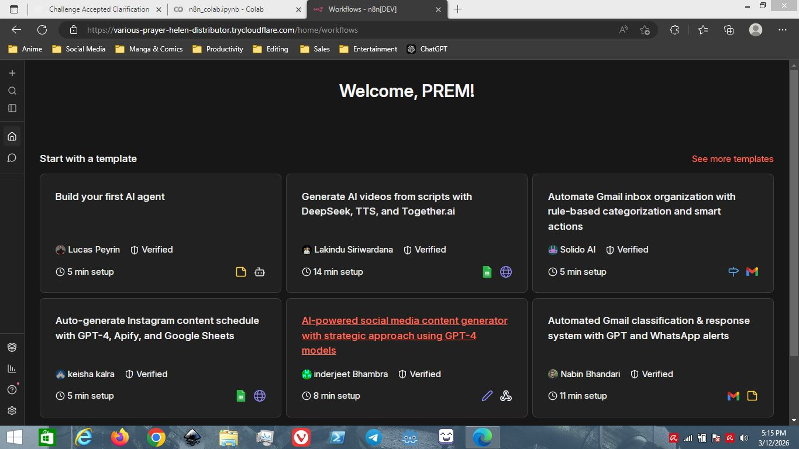

# Run n8n on Google Colab (No Credit Card Required)

[](https://colab.research.google.com/github/prem8116/n8n_colab_launcher/blob/main/n8n_colab_launcher.ipynb)


Run **n8n workflow automation** on Google Colab without providing payment information or setting up a server.

Many cloud platforms require credit card verification even for free tiers.
This notebook removes that barrier so beginners can experiment with automation instantly.

---

## Why This Project Exists

Many automation beginners struggle to try n8n because most cloud platforms require:

* credit card verification
* server deployment
* Docker knowledge
* infrastructure setup

Platforms like:

* Render
* Railway
* Fly.io
* Northflank
* Oracle Cloud free tier

often require payment details or complicated setup.

This project provides a simple alternative.

With this notebook you can run **n8n automation workflows on Google Colab** without:

* credit card
* server setup
* Docker
* cloud deployment

---

## Project Status

This project is actively maintained and tested on Google Colab.

Current features:

* Run n8n automation server on Google Colab
* No credit card required
* Persistent workflows using Google Drive
* Public access using Cloudflare tunnel
* Reuse existing n8n account between sessions

---

## Features

* Run **n8n workflow automation** on Google Colab
* No hosting setup required
* No credit card required
* Persistent workflows via Google Drive
* Public access via Cloudflare tunnel
* Simple one-click launch with Colab

---

## Who This Is For

This project is useful for:

* beginners learning n8n
* automation enthusiasts
* students exploring workflow automation
* developers testing automation ideas

If you want to **try n8n quickly without deploying a server**, this notebook is the fastest way.

---

## Quick Start

1. Click the **Open in Colab** button above
2. Run all notebook cells
3. Wait for the public URL to appear
4. Open the URL in your browser
5. Access the n8n dashboard

---

## Dashboard Preview



---

## How It Works

This notebook launches the **n8n automation server** inside Google Colab.

The notebook automatically:

1. Installs Node.js
2. Installs n8n
3. Starts the n8n server
4. Stores workflows in Google Drive
5. Creates a public URL using a Cloudflare tunnel

This allows anyone to experiment with **workflow automation and no-code automation tools** without running their own server.

---

## Limitations

* Google Colab sessions are temporary
* Public URL changes every run
* Long-running automations may stop when Colab runtime stops
* Not suitable for production workloads

This setup is intended mainly for **learning and testing automation workflows**.

---

## Repository Structure

```
n8n_colab_launcher
│
├── n8n_colab_launcher.ipynb
├── README.md
├── dashboard.png
```

---

## Topics

automation • n8n • google-colab • workflow-automation • nocode • lowcode

---

## Author

Created by **prem8116**

---

## License

MIT License
